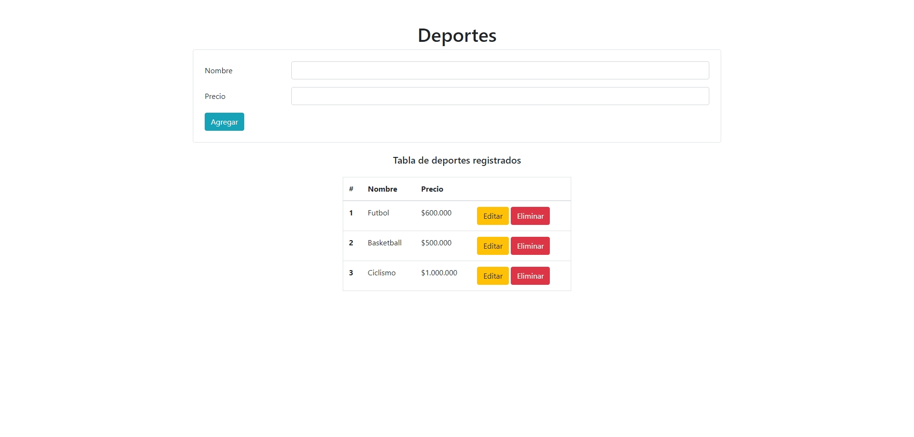

# Prueba - Club deportivo

## Descripción

El **Club Deportivo Discipline Spa** necesita una aplicación para gestionar los deportes que ofrece en sus sucursales. La aplicación debe permitir registrar, visualizar, editar y eliminar deportes, y mantener esta información actualizada en un archivo JSON. El objetivo es desarrollar un sistema CRUD que interactúe con un archivo JSON para almacenar y gestionar los datos de los deportes.

El desafío consiste en crear un servidor que maneje estas operaciones CRUD, así como implementar las rutas necesarias para cumplir con los requisitos.

## Vista del Diseño

Aquí puedes ver la imagen del diseño que se utilizó como referencia:

## Requerimientos

1. **Crear un nuevo deporte**:
   - **Ruta**: `POST /deportes`
   - **Descripción**: Recibe el nombre y precio de un nuevo deporte, lo persiste en un archivo JSON.

2. **Consultar todos los deportes**:
   - **Ruta**: `GET /deportes`
   - **Descripción**: Devuelve en formato JSON todos los deportes registrados en el archivo JSON.

3. **Editar un deporte**:
   - **Ruta**: `PUT /deportes/:nombre`
   - **Descripción**: Edita el precio de un deporte registrado utilizando el nombre del deporte como parámetro y persiste este cambio en el archivo JSON.

4. **Eliminar un deporte**:
   - **Ruta**: `DELETE /deportes/:nombre`
   - **Descripción**: Elimina un deporte solicitado desde el cliente y persiste este cambio en el archivo JSON.

## Tecnologías Utilizadas

- **Node.js**: Entorno de ejecución para JavaScript en el servidor.
- **Express**: Framework para Node.js que facilita la creación y manejo del servidor y las rutas.
- **File System (fs)**: Módulo de Node.js para manipular el sistema de archivos, utilizado para leer y escribir en el archivo JSON.
- **JSON**: Formato de intercambio de datos utilizado para almacenar la información de los deportes.

## Autor

Este proyecto fue desarrollado por **Valeria Torrealba**.
